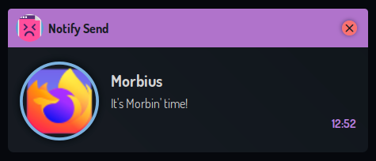
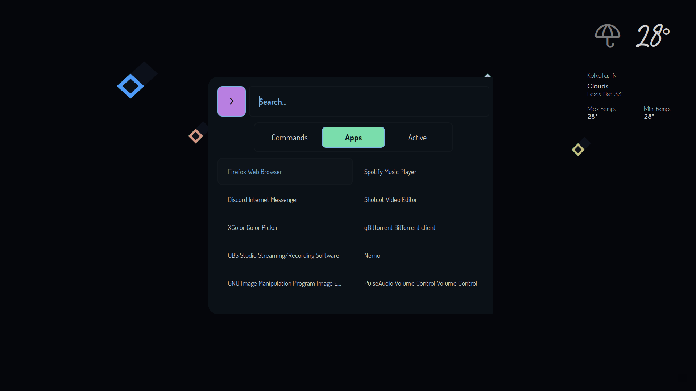

ANIMATION Hyprland
 => check what's possible

INIT:
    Check init script
        Weather => Change locatgion to perosnal one USE ENV VARIABLE
        Microphone => TODO

GENERAL:
    wifi
    dock bottom

BOTTOM_BAR:
    bootom bar => DOCK SCRIPT
    disable battery if no EWW_BATTERY DESKTOP 

NETWORK
    SPeedtest: own widget
    check all scripts and code
    show networsk wifi and wired
    vpn off =>  Mullvad, and wireguard
    EWW_NET.wlan0 => correct this not always wlan0

SIDEBAR:
    BATTERY for desktop to hide

GIT:
    ADD alarms.mp3
    ADD dunst config
     add Kitty config
    ADD rofi config
    ADD FONTS USING NIX
    Add fonts icomon, 
    $font_sans: "Kyok Medium";
    $font_sans_light: "Kyok Light";
    $font_sans: "Google Sans Medium";
 https://github.com/elenapan/startpage => CHANGE AND PUT INTO git
 Nix firefox => save evetying one place, save settings

OTHERS:
What do i want to show ?

- alert notification if one of my website fails
- workspaces
- music player
- what to eat for today
- calendar and notifications
- task todos
- dock

- dashboard to monitor servrs and other stuff

- see cpu, ram usage,
= change volume, change wifi connection, disconnect to wired, bluettoth,
brightnes, power stuff, parameters

STUFF TODO:
    leanr how to use neovim

MY OWN GUI:

    test hyprland plugin

    Login manager

    WALLPAPER:
    - change wallpaper every day from r/animewallpaper, try multi monitor wallpaper
    https://www.reddit.com/r/Animewallpaper/top/?t=all =>   wallpaper using redlib instance and grab a random one on r/Animewallpaper
    multipl monitor => https://github.com/LGFae/swww/issues/121
    swww transiation => random
    also change on hyprlock
    wallapaper => custom theme

    MELA planning:
    Meal planning

    SHOPPING LIST:

    MUSICPLAYER:
    https://www.omgubuntu.co.uk/2021/07/spotify-now-playing-conky-linux-widget => pochette album en fond, add lyrics if possible, click to open spotify

    AUID SOURCE:
        liste audio source

    MENU
    menu demarrer => une photo/anime ou autre

    Terminal;
        WHen starting nice colorful animated ascii maybe a kitten or some good food (xialong bao)

    Notification
    

    weather top right
    

https://www.youtube.com/watch?v=AnyRdOqzLpc
https://github.com/dharmx/vile
https://www.youtube.com/watch?v=Qcl_9k_RaS0

swww = pkgs.fetchFromGitHub {
    owner = "LGFae";
    repo = "swww";
    tag = "v0.9.5";
    sha256 = lib.fakeSha256;
    #sha256 = "567e2ac76203ad47df5aaafab7d9d0e4e283a74e34690930a4730ecf0a667428";
  };

nix flake prefetch github:LGFae/swww/v0.9.5

Downloaded 'github:LGFae/swww/3ee69e3286d9aeb0614f32fe28eee4477d661b02?narHash=sha256-ldy9HhIsWdtTdvtRLV3qDT80oX646BI4Q%2BYX5wJXbsc%3D' to '/nix/store/0317hqv83fz530bjbnmjpxvahh52k7jm-source' (hash 'sha256-ldy9HhIsWdtTdvtRLV3qDT80oX646BI4Q+YX5wJXbsc=').
